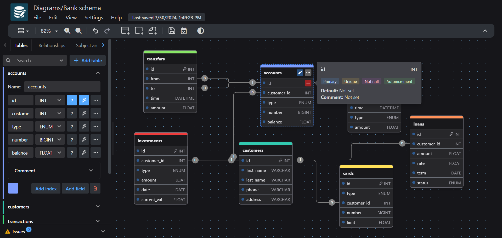

# drawDB

    
    
    

drawDB is an online database entity-relationship diagram editor and SQL generator. Design, visualize stunning diagrams, and export scripts without an account and completely free of charge. See the full set of features [here](https://www.drawdb.app).

If you need anything, have an idea, or just want to say hi, feel free to send an email to drawdb@outlook.com or message us on Discord.

### Special thanks to

<a href="https://www.warp.dev/drawdb/" target="_blank">

 
<b>Next-gen AI-powered intelligent terminal for all platforms</b>
</a>

